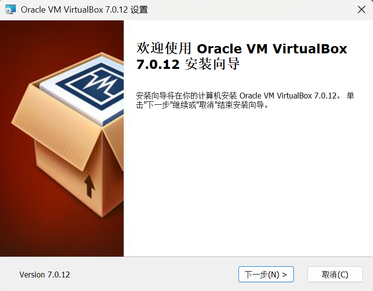
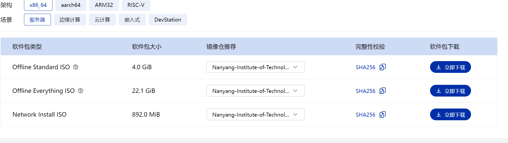
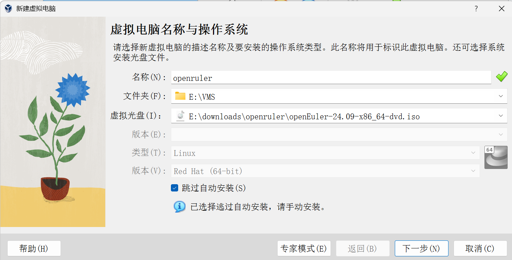
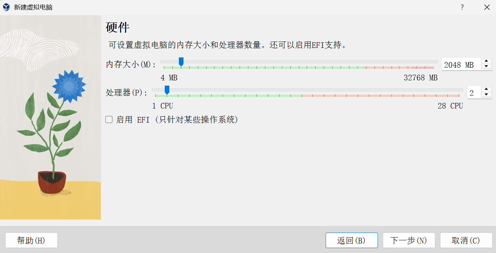
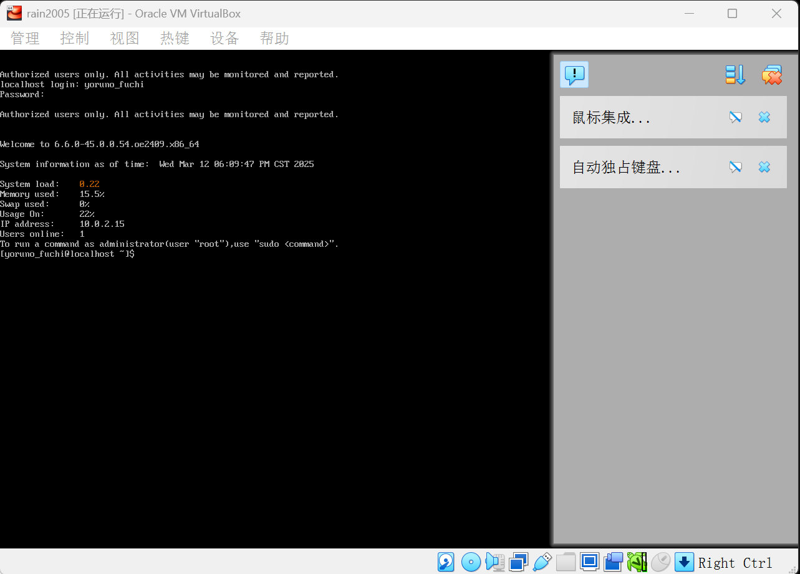

# 使用VirtualBox虚拟机安装openRuler

## 一、下载VirtualBox

首先访问VirtualBox官网https://www.virtualbox.org/，下载合适的版本。之后进行安装。

之后下载open ruler镜像。https://www.openeuler.org/zh/download/在此官网中选择合适的软件包进行下载：

## 二、创建虚拟机

首次启动虚拟机时，我们在选择安装镜像时，选择下载好的openruler镜像：

之后进行内存、CPU核心和虚拟硬盘空间的分配：

首次启动虚拟机需要安装镜像，安装目的地、主机名和root账户选择等手动操作，设置好之后进行安装即可。

安装之后关闭虚拟机，之后打开虚拟机的设置->系统，在启动顺序中把硬盘调至第一位，再打开虚拟机，即可开始使用openruler。

输入设置好的用户名和密码登录，即可进入命令行界面。

