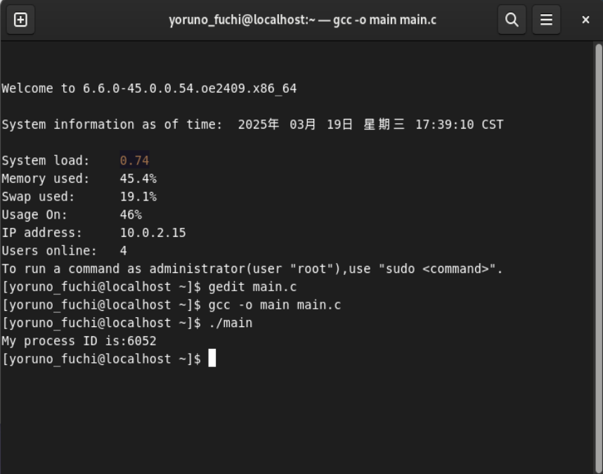

# 利用Linux环境，在命令行下编辑并编译代码

## 1.安装gedit文本编辑器

在Linux系统中，我们在命令行界面中输入以下内容：

```bash
gedit main.c 
```

结果出现以下信息：


这说明我们的系统中没有安装gedit文本编辑器，应当下载。openruler的linux系统兼容大量的CentOS/RHEL开发的应用，所以我们在此使用相应的包管理器安装gedit，命令行内输入：

```bash
sudo yum install gedit
```

之后确认安装，耐心等待即可。由此我们便掌握了如何在linux系统中安装所需的软件包，以后若遇到相同问题则不再赘述。

## 2.安装桌面编辑器

在这之后我们再次尝试打开编辑器，编辑一个名字为main.c的文件，但是出现以下问题：


可以看到，我们输入命令：`systemctl get-default`之后输出为`multi-user.target`，代表我们没有让系统设置为图形界面。所以决定安装GNOME桌面环境：

```bash
sudo dnf groupinstall "Server with GUI"  # 安装图形界面
sudo systemctl set-default graphical.target  # 设置为图形界面模式
sudo reboot  # 重启系统
```

再次检查默认运行模式后得到：


说明已然进入图形界面模式，在这之后安装对应的显示管理器：`sudo dnf install gdm`

在这之后检查显示管理器状态：

说明并没有进入运行状态，我们输入`sudo systemctl start gdm `


成功进入图形界面模式！

## 3.回到最初的起点：打开编辑器写代码

首先在命令行中输入以下命令安装`gnome-terminal`

```bash
sudo dnf install gnome-terminal
```

返回图形界面后，运行终端，输入`gedit main.c`：

进入main.c文件后，编写相关的代码：


此后打开主文件夹，可以找到文件:main.c


## 4.在命令行内编译

1. 简单说下如何编译：

   Linux上面使用的编译器是GCC编译器。GCC命令的基本用法如下：`gcc [options] [filenames]`

​	i)options：GCC常用选项

​		我们可以用-o选项为即将产生的可执行文件指定一个文件名来作为可执行文件名。譬如：

​		在本次作业中，我使用以下代码得到main.c的可执行文件：main

```bash
gcc -o main main.c
```

​	ii)执行文件

​	格式：  ./可执行文件名 例如：./main

2.编译和执行文件：

首先输入 `gcc -o main main.c`, 表示编译运行，此时生成了一个执行文件main

之后输入./main 表示执行文件main

得到的结果如下：



fork代码实例1的输出结果：


fork代码实践例2的输出结果：

