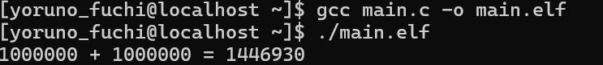
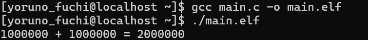
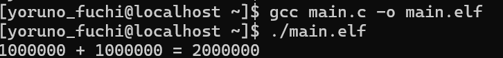

# 一、三个示例代码的编译与运行：

1.代码1：

```c
#include <pthread.h>
#include <stdio.h>

int sum = 0;

void* thread(void*) {
    int i;
    for (i = 0; i < 1000000; i++)
        sum++;

    return NULL;
}

int main(void) {
    pthread_t tid1, tid2;

    pthread_create(&tid1, NULL, thread, NULL);
    pthread_create(&tid2, NULL, thread, NULL);

    pthread_join(tid1, NULL);
    pthread_join(tid2, NULL);

    printf("1000000 + 1000000 = %d\n", sum);
    return 0;
}
```

输出结果如下：



出现错误的原因是：sum 是全局变量，被两个线程 同时修改。

代码2的运行结果：


sum += 1 并非原子操作，实际分为三步：
从内存读取 sum 到寄存器；寄存器中的值加1；将结果写回内存。当两个线程同时执行这些步骤时，可能会发生覆盖，导致部分操作丢失。

2.输出结果如下：




3.输出结果：



# 二、实现生产者、消费者问题：

1、问题解析：

该问题描述了共享固定大小缓冲区的两个线程——即所谓的“生产者”和“消费者”——在实际运行时会发生的问题。生产者的主要作用是生成一定量的数据放到缓冲区中，然后重复此过程。与此同时，消费者也在缓冲区消耗这些数据。**该问题的关键就是要保证生产者不会在缓冲区满时加入数据，消费者也不会在缓冲区中空时消耗数据。**

要解决该问题，就必须让生产者在缓冲区满时休眠（要么干脆就放弃数据），等到下次消费者消耗缓冲区中的数据的时候，生产者才能被唤醒，开始往缓冲区添加数据。同样，也可以让消费者在缓冲区空时进入休眠，等到生产者往缓冲区添加数据之后，再唤醒消费者。通常采用进程间通信的方法解决该问题。如果解决方法不够完善，则容易出现死锁的情况。出现死锁时，两个线程都会陷入休眠，等待对方唤醒自己。该问题也能被推广到多个生产者和消费者的情形。

所以生产者的操作伪代码大致为：

```c
while (未生产完) {
        生产数据 ->
        wait(empty) -> //检测缓冲区是否有空闲位置 用empty实现
        lock(mutex) ->//互斥锁 确保对缓冲区的独占访问
        放入缓冲区 ->
        unlock(mutex) ->
        signal(full)//通过full通知消费者缓冲区有新数据 full值加一 满时等到下次消费者消耗缓冲区中的数据的时候，生产者才能被唤醒
    }
```

消费者操作伪代码：

```c
消费者:
    while (未消费完) {
        wait(full) ->
        lock(mutex) ->
        取出数据 ->
        unlock(mutex) ->
        signal(empty) ->
        消费数据
    }
```

代码如下：

```c
#include <stdio.h>
#include <pthread.h>
#include <semaphore.h>

#define BUFFER_SIZE 5      
#define PRODUCER_NUM 2     
#define CONSUMER_NUM 2     
#define ITEMS_PER_THREAD 5 

int buffer[BUFFER_SIZE];   
int in = 0;               
int out = 0;               

sem_t empty;               
sem_t full;               
pthread_mutex_t mutex;     

// 生产者线程函数
void* producer(void* arg) {
    int thread_id = *(int*)arg;
    for (int i = 0; i < ITEMS_PER_THREAD; i++) {
        int item = thread_id * 100 + i; 
        
        sem_wait(&empty);// wait 检测》0 确保是缓冲区有空闲槽位 empty是信号量 >0表示有空 ==满了         
        pthread_mutex_lock(&mutex);    
        
        buffer[in] = item;            
        printf("生产者%d 生产: %d (位置: %d)\n", thread_id, item, in);
        in = (in + 1) % BUFFER_SIZE;  
        
        pthread_mutex_unlock(&mutex);
        sem_post(&full);              
    }
    return NULL;
}

// 消费者线程函数
void* consumer(void* arg) {
    int thread_id = *(int*)arg;
    for (int i = 0; i < ITEMS_PER_THREAD; i++) {
        sem_wait(&full);              
        pthread_mutex_lock(&mutex);   
        
        int item = buffer[out];        
        printf("消费者%d 消费: %d (位置: %d)\n", thread_id, item, out);
        out = (out + 1) % BUFFER_SIZE; 
        
        pthread_mutex_unlock(&mutex);
        sem_post(&empty);              
    }
    return NULL;
}

int main() {
    pthread_t producers[PRODUCER_NUM];
    pthread_t consumers[CONSUMER_NUM];
    int producer_ids[PRODUCER_NUM];
    int consumer_ids[CONSUMER_NUM];
    

    sem_init(&empty, 0, BUFFER_SIZE); //==0表示满了
    sem_init(&full, 0, 0);             
    pthread_mutex_init(&mutex, NULL);  


    for (int i = 0; i < PRODUCER_NUM; i++) {
        producer_ids[i] = i;
        pthread_create(&producers[i], NULL, producer, &producer_ids[i]);
    }

    for (int i = 0; i < CONSUMER_NUM; i++) {
        consumer_ids[i] = i;
        pthread_create(&consumers[i], NULL, consumer, &consumer_ids[i]);
    }
    
    // 等待所有生产者线程结束
    for (int i = 0; i < PRODUCER_NUM; i++) {
        pthread_join(producers[i], NULL);
    }
    for (int i = 0; i < CONSUMER_NUM; i++) {
        pthread_join(consumers[i], NULL);
    }

    sem_destroy(&empty);
    sem_destroy(&full);
    pthread_mutex_destroy(&mutex);
    
    printf("所有生产消费操作完成！\n");
    return 0;
}
```

编译后运行结果如下：


# 三、代码解析：

Q1

1. 主线程创建子线程，子线程立即调用 `pthread_exit(42)`。
2. 主线程通过 `pthread_join` 等待子线程结束，并接收返回值。
3. 返回值 `42` 被强制转换为 `void*` 传递给主线程，最终打印为整数42。

Q2

exit(42) 是C标准库函数，它会终止整个进程（包括所有线程）,因此，当子线程调用 exit(42) 时，主线程和子线程会立即终止，程序不会执行后续代码。

Q3

若 thread2 先修改 i 为0，thread 返回0，最终输出0。
若 thread 先返回42，thread2 随后修改 i 为0，最终输出 0。
若 thread 的返回值覆盖 thread2 的修改，输出 42。

Q4

子线程调用 pthread_detach 分离自身。分离后的线程 资源会自动回收，主线程无法通过 pthread_join 获取其返回值。所以pthread_join 因线程已分离返回错误，i 的值未被修改，输出 0。

Q5

thread 读取 i 的值并打印。thread2 修改 i 的值为31。此题没有使用互斥锁或原子操作，导致操作顺序不可预测。
其可能的输出为：
如果 thread 在 thread2 修改前执行，输出 42。
如果 thread 在 thread2 修改后执行，输出 31。

Q6：

由于线程执行顺序不确定，可能的输出为：
Thread 0
Thread 1
或
Thread 1
Thread 0

Q7

由于 共享变量的竞争条件，实际输出结果不可预测。可能先输出i[1]的地址，或者i[0]的地址。