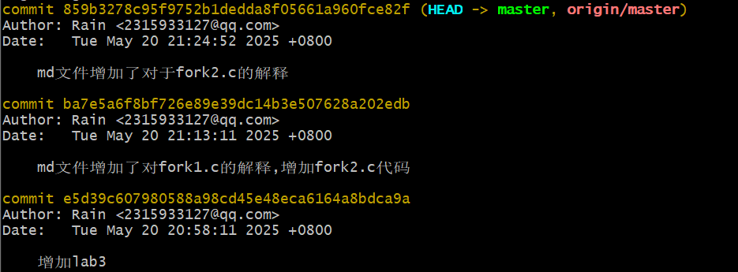

# 一、ppipe.c实例代码的解释：

## （一）pipe1和pipe2：

因为管道(pipe)是一种进程间通信(IPC)机制，允许一个进程向另一个进程发送数据。管道有以下特点：

- 半双工通信：数据只能单向流动
- 通常需要两个管道来实现双向通信
- 数据按FIFO(先进先出)方式流动

所以为了实现全双工 需要建立两个管道 分别管理：

1. `pipe1`：用于父进程向子进程发送数据：
2. `pipe2`：用于子进程向父进程发送数据

pipe1[0]:表示父亲的读端，pipe1[1]父亲的写端：

pipe2[0]:表示儿子的读端，pipe2[1]儿子的写端：


### 1.pid==0：

关闭pipe[1]父亲的写端，pipe2[0]儿子的读端；

接下来循环执行从父亲写入的管道里执行pipe1[0]：读取父亲管道的内容：x

然后通过儿子向父亲传输的管道中写入x++后的内容：

循环执行十次

### 2.pid>0时：

关闭pipe1[0]：因为父亲要写入，这次是父亲是写端 儿子是读端 所以要关闭儿子的写端和父亲的读端

具体内容与上类似。

父进程和子进程的执行顺序由操作系统调度决定，实际输出顺序可能不同。


## （二）fork()的返回值规定：

1.返回值规定：

1. **`pid < 0`**：`fork()` 调用失败，需处理错误（例如打印错误信息并退出）。
2. **`pid == 0`**：当前进程是子进程。
3. **`pid > 0`**：当前进程是父进程，`pid` 值为子进程的PID。

2.fork的作用：每调用一次fork()则创建一次个子进程

## （三）代码的运行过程：

1.初始化阶段：

```c
 pid = fork(); //创建子进程


int pipe1[2]; 
int pipe2[2]; //创建两个管道
```

2.第一次通信：

父进程和子进程运行的顺序不确定，但是我们仍可以确定在第一次通信时是父进程先写入，子进程再读取。因为初始值`x=1`是在父进程中得以定义，所以先关闭不必要的窗口：

```c
close(pipe1[0]); 
close(pipe2[1]);
```

再将x的值写入到pipe1中：

```c
write(pipe1[1], &x, sizeof(int)); 
```

接下来父进程等待读取pipe2的内容；

子进程通过pipe1[0]读取初始化的x=1的值，打印并且递增x，通过pipe2[1]写回：

```c
read(pipe1[0], &x, sizeof(int)); 
printf("child %d read: %d\n", getpid(), x++); 
write(pipe2[1], &x, sizeof(int));
```

之后父进程再读取该值:

```c
read(pipe2[0], &x, sizeof(int)); 
printf("parent %d read: %d\n", getpid(), x++);
```

后续父子进程进入循环，重复上述过程，直到x>9结束，输出结果如下：

```bash
child 1998 read: 1
parent 1997 read: 2
child 1998 read: 3
parent 1997 read: 4
child 1998 read: 5
parent 1997 read: 6
child 1998 read: 7
parent 1997 read: 8
child 1998 read: 9
parent 1997 read: 10
```

# 二、fork1.c代码解释：

## （一）进程创建和执行流程：

1.第一次循环：

在第一次循环中(i=0)：父进程C0调用，创建子进程 C1。

之后父进程进入 `pid > 0` 分支，调用 `wait(NULL)` 等待 C1 结束。

在C1结束后，打印` value = 5`（全局变量未被修改），最终调用 `exit(0)` 退出，不再执行第二次循环。

子进程进入 `pid == 0` 分支，修改 `value` 为 5 + 15 = 20。打印 `value = 20`。同时循环变量 i 递增为 1，进入第二次循环。

2.第二次循环(i=1)：

子进程 C1 调用 fork()，创建孙子进程 C2。类似于第一次循环中的C0，进入 `pid > 0` 分支，调用 `wait(NULL)` 等待 C2 结束。在C2结束后，打印 `PARENT: value = 20`。最后调用 `exit(0)` 退出（返回到第一次循环）。

孙子进程进入 `pid == 0` 分支，修改 `value` 为 `20 + 15 = 35`，之后打印 `Child: value = 35`，之后退出。

## （二）输出结果：

```bash
Child: value = 20
Child: value = 35
PARNET: value = 20
PARNET: value = 5
```

# 三、fork2.c代码解释：

## （一）、定义两个函数：

观察可知 f(x)为阶乘函数，f(y)类似于斐波那契函数，我们都可以用递归的方式定义他们：

```c
// 计算 f(x) (阶乘)
long long compute_fx(int x) {
    long long result = 1;
    for (int i = 2; i <= x; i++) {
        result *= i;
    }
    return result;
}

// 计算 f(y) (类斐波那契)
long long compute_fy(int y) {
    if (y == 1 || y == 2) return 1;
    long long a = 1, b = 1, c;
    for (int i = 3; i <= y; i++) {
        c = a + b;
        a = b;
        b = c;
    }
    return b;
}
```

## （二）、创建管道和进程

创建两个管道，分别用于父子进程间传递 *f*(*x*) 和 *f*(*y*) 的计算结果。

其中：子进程1计算 *f*(*x*)，结果写入 `pipe_fx`；子进程2：计算 *f*(*y*)，结果写入 `pipe_fy`。父进程：汇总结果并计算 *f*(*x*,*y*)。

具体创建代码如下：

```c
int main() {
    int x, y;
    printf("Enter x and y: ");
    scanf("%d %d", &x, &y);

    int pipe_fx[2], pipe_fy[2];
    if (pipe(pipe_fx) == -1 || pipe(pipe_fy) == -1) {
        perror("pipe error");
        exit(EXIT_FAILURE);
    }

    pid_t pid_fx = fork();
    if (pid_fx < 0) {
        perror("fork error");
        exit(EXIT_FAILURE);
    } else if (pid_fx == 0) {

        close(pipe_fx[0]);  
        long long result = compute_fx(x);
        write(pipe_fx[1], &result, sizeof(result));
        close(pipe_fx[1]);
        exit(EXIT_SUCCESS);
    }

    pid_t pid_fy = fork();
    if (pid_fy < 0) {
        perror("fork error");
        exit(EXIT_FAILURE);
    } else if (pid_fy == 0) {
        close(pipe_fy[0]); 
        long long result = compute_fy(y);
        write(pipe_fy[1], &result, sizeof(result));
        close(pipe_fy[1]);
        exit(EXIT_SUCCESS);
    }

    close(pipe_fx[1]); 
    close(pipe_fy[1]);

    long long fx, fy;
    read(pipe_fx[0], &fx, sizeof(fx));
    read(pipe_fy[0], &fy, sizeof(fy));

    printf("f(x,y) = %lld + %lld = %lld\n", fx, fy, fx + fy);

    waitpid(pid_fx, NULL, 0);
    waitpid(pid_fy, NULL, 0);

    return 0;
}
```

通过该方式，实现了父进程和两个子进程协作完成*f*(*x*,*y*) 的计算。

为什么要建立两个管道？因为为了实现f（x,y）一个进程负责计算fx一个负责fy 最后计算结果通过管道传输给主进程计算fxy

# 四、git commit 记录

