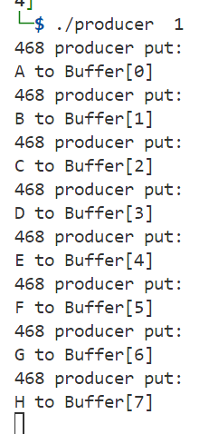
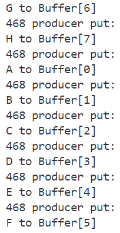
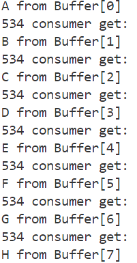
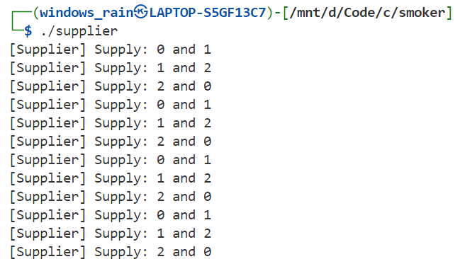
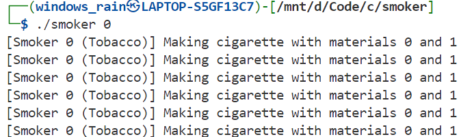
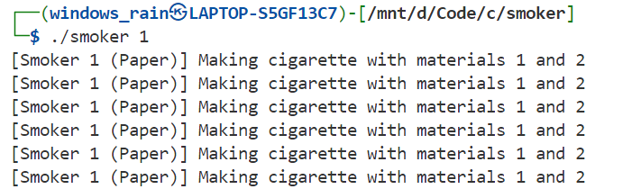
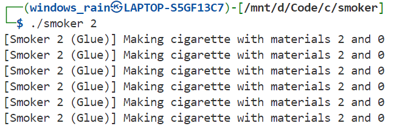

实验四：进程同步实验报告

## 1. 实验目的与意义

本实验旨在加深对并发协作进程同步与互斥概念的理解，通过实际编程和调试，观察和体验并发进程同步与互斥操作的效果。实验涵盖了经典的生产者/消费者问题和抽烟者问题，使用Linux系统的IPC机制（共享内存、信号量、消息队列）来实现进程间的同步与互斥。

## 2. 进程同步原理解释

### 2.1 进程同步原理

在多进程并发执行环境中，进程间需要协调执行顺序以避免竞态条件和死锁。操作系统提供的同步机制主要包括：

1. **互斥(Mutual Exclusion)**: 确保同一时刻只有一个进程能访问临界资源
2. **同步(Synchronization)**: 控制进程执行的先后顺序，实现进程间的协作

### 2.2 信号量机制

信号量是由Dijkstra提出的经典同步工具，包含两个原子操作：
- **P操作(down)**: sem_value--, 如果结果<0则进程阻塞
- **V操作(up)**: sem_value++, 如果结果≤0则唤醒等待进程

信号量的物理意义：
- **初值**: 表示可用资源的数量或同步条件的初始状态
- **正值**: 表示可用资源数量
- **零值**: 表示资源刚好用完
- **负值**: 表示等待该资源的进程数量

## 3. 示例实验分析：生产者/消费者问题

### 3.1 问题描述

生产者/消费者问题是经典的进程同步问题，涉及：
- 多个生产者进程向有界缓冲区放入产品
- 多个消费者进程从缓冲区取出产品
- 缓冲区满时生产者阻塞，缓冲区空时消费者阻塞

### 3.2 同步机制设计

#### 信号量设置
```c
// 生产者同步信号量：初值为缓冲区大小(8)
prod_sem = set_sem(prod_key, buff_num, sem_flg);

// 消费者同步信号量：初值为0(无产品可取)
cons_sem = set_sem(cons_key, 0, sem_flg);

// 生产者互斥信号量：初值为1
pmtx_sem = set_sem(pmtx_key, 1, sem_flg);

// 消费者互斥信号量：初值为1
cmtx_sem = set_sem(cmtx_key, 1, sem_flg);
```

#### 生产者进程逻辑
```c
while(1) {
    down(prod_sem);    // 等待空槽位
    down(pmtx_sem);    // 进入临界区
    
    // 生产产品到缓冲区
    buff_ptr[*pput_ptr] = 'A' + *pput_ptr;
    *pput_ptr = (*pput_ptr + 1) % buff_num;
    
    up(pmtx_sem);      // 离开临界区
    up(cons_sem);      // 通知消费者
}
```

#### 消费者进程逻辑
```c
while(1) {
    down(cons_sem);    // 等待产品
    down(cmtx_sem);    // 进入临界区
    
    // 从缓冲区消费产品
    printf("get: %c from Buffer[%d]\n", buff_ptr[*cget_ptr], *cget_ptr);
    *cget_ptr = (*cget_ptr + 1) % buff_num;
    
    up(cmtx_sem);      // 离开临界区
    up(prod_sem);      // 通知生产者
}
```

### 3.3 实验结果

1. **初始阶段**: 生产者快速填满8个缓冲区位置后阻塞

 

1. **消费者启动**: 消费者读取产品后唤醒阻塞的生产者

    

3. **稳定运行**: 生产者和消费者交替执行，维持缓冲区在合理利用率 图片同上

## 5. 独立实验分析：抽烟者问题

### 5.1 问题描述

抽烟者问题涉及：
- 3个抽烟者，分别拥有烟草、纸、胶水中的一种
- 2个供应者轮流提供三种材料中的两种
- 拥有剩余材料的抽烟者可以卷烟，完成后通知供应者继续

### 5.2 解决方案设计

#### 共享数据结构
```c
struct shared_data {
    int current_combination;  // 当前供应组合(0-2)
    int supplied[2];          // 供应的两种材料
};
```

#### 信号量配置
```c
int mutex = set_sem(2000, 1, IPC_CREAT | 0666);          // 互斥锁
int smoker_sem[3] = {
    set_sem(3000, 0, IPC_CREAT | 0666),  // 抽烟者0信号量
    set_sem(3001, 0, IPC_CREAT | 0666),  // 抽烟者1信号量  
    set_sem(3002, 0, IPC_CREAT | 0666)   // 抽烟者2信号量
};
int done_sem[3] = {
    set_sem(4000, 0, IPC_CREAT | 0666),  // 完成信号量
    set_sem(4001, 0, IPC_CREAT | 0666),
    set_sem(4002, 0, IPC_CREAT | 0666)
};
```

#### 供应者逻辑
```c
while(1) {
    down(mutex);  // 进入临界区
    
    // 循环选择供应组合
    int current = shared->current_combination;
    shared->current_combination = (current + 1) % 3;
    
    // 设置供应材料
    switch(current) {
        case 0: supply_tobacco_and_paper(); break;
        case 1: supply_paper_and_glue(); break;
        case 2: supply_glue_and_tobacco(); break;
    }
    
    up(smoker_sem[current]);  // 唤醒对应抽烟者
    up(mutex);                // 离开临界区
    
    down(done_sem[current]);  // 等待抽烟者完成
}
```

#### 抽烟者逻辑
```c
while(1) {
    down(smoker_sem);  // 等待被唤醒
    
    // 卷烟并抽烟
    printf("[Smoker %d] Making cigarette\n", smoker_id);
    sleep(1);  // 模拟卷烟时间
    
    up(done_sem);  // 通知供应者完成
}
```

### 5.3 同步机制解释

1. **互斥控制**: mutex信号量确保供应者对共享数据的互斥访问
2. **条件同步**: smoker_sem数组控制特定抽烟者的等待和唤醒
3. **完成通知**: done_sem数组实现抽烟者向供应者的完成反馈

### 5.4实验结果

#### 1.supplier循环供应三组材料：



#### 2.三个smoker不断地循环等待所需的材料 一有合适的材料就抽烟







## 6. 多进程压力测试

### 6.1 测试场景设计

为验证同步机制的正确性，进行了以下测试：

1. **多生产者多消费者测试**:
   - 同时运行4个生产者进程(不同执行速率：1s, 2s, 3s, 4s)
   - 同时运行4个消费者进程(不同执行速率：1s, 2s, 3s, 4s)

2. **启动顺序测试**:
   - 先启动生产者，后启动消费者
   - 先启动消费者，后启动生产者
   - 交替启动生产者和消费者

### 6.2 测试结果分析

#### 正常运行情况
```bash
# 生产者输出示例
12263 producer put: A to Buffer[0]
12264 producer put: B to Buffer[1]
12265 producer put: C to Buffer[2]

# 消费者输出示例  
12528 consumer get: A from Buffer[0]
12529 consumer get: B from Buffer[1]
```

#### 同步正确性验证
1. **缓冲区满时**: 所有生产者正确阻塞，等待消费者释放空间
2. **缓冲区空时**: 所有消费者正确阻塞，等待生产者提供产品
3. **互斥性**: 同一缓冲区位置不会被同时访问
4. **无死锁**: 长时间运行未出现死锁现象

## 7. 信号量机制的物理意义深入分析

### 7.1 信号量初值的设计原则

1. **资源信号量**: 初值 = 可用资源总数
   - 生产者同步信号量初值为缓冲区大小
   - 表示最大可并发的生产操作数

2. **事件信号量**: 初值 = 0
   - 消费者同步信号量初值为0
   - 表示初始无产品可消费的状态

3. **互斥信号量**: 初值 = 1
   - 确保临界区的互斥访问
   - 值为1表示资源可用，值为0表示资源被占用

### 7.2 信号量值变化的含义

- **正值**: 表示可用资源数量或可以继续执行的进程数
- **零值**: 表示资源恰好用完，是临界状态
- **负值**: 表示等待队列中阻塞进程的数量

### 7.3 同步与互斥的实现机制

1. **同步实现**: 
   - 通过控制信号量的P/V操作顺序
   - 确保进程按正确顺序执行

2. **互斥实现**:
   - 临界区前执行P操作，临界区后执行V操作
   - 确保同时只有一个进程在临界区执行

## 8. 实际操作系统中IPC机制的应用

### 8.1 Linux IPC机制特点

1. **持久性**: IPC对象在创建进程结束后仍然存在
2. **系统级**: 由内核管理，不同进程可通过键值访问
3. **权限控制**: 支持基于用户和组的访问权限控制

### 8.2 与理论教材的对应关系

1. **抽象信号量对应System V信号量**:
   - 理论：P/V操作
   - 实现：semop()系统调用

2. **临界区对应共享内存**:
   - 理论：需保护的共享资源
   - 实现：shmget/shmat映射的内存区域

3. **进程调度对应信号量阻塞队列**:
   - 理论：进程状态转换
   - 实现：内核维护的等待队列

## 9. 问题与改进

### 9.1 发现的问题

1. **资源泄漏**: 程序异常退出时IPC对象可能残留
2. **性能开销**: 系统调用频繁切换用户态/内核态
3. **调试困难**: 多进程并发执行时状态难以观察

### 9.2 改进建议

1. **资源管理**: 
   - 添加信号处理函数，程序退出时清理IPC对象
   - 使用ipcrm命令定期清理残留对象

2. **性能优化**:
   - 批量操作减少系统调用次数
   - 使用条件变量替代轮询等待

3. **调试支持**:
   - 增加详细的日志输出
   - 使用调试工具跟踪进程状态

## 10. 实验总结

### 10.1 主要收获

1. **理论联系实际**: 深入理解了操作系统教材中抽象的同步概念在实际系统中的具体实现
2. **编程实践**: 掌握了Linux IPC机制的使用方法和编程技巧
3. **问题解决**: 学会了分析和解决并发程序中的同步问题

### 10.2 核心认识

1. **信号量是实现同步的关键工具**: 通过合理设计信号量的初值和操作顺序，可以解决各种复杂的同步问题

2. **同步与互斥相辅相成**: 在解决实际问题时，往往需要同时考虑进程间的同步和对共享资源的互斥访问

3. **系统设计的重要性**: 良好的同步机制设计是构建可靠并发系统的基础

### 10.3 实践验证结果

通过大量的测试验证，本实验的两个程序（生产者/消费者和抽烟者问题）都能够正确处理多进程并发场景，没有出现竞态条件、死锁或数据不一致等问题，充分说明了IPC同步机制的有效性和可靠性。

实验成功展示了操作系统理论知识在实际系统中的应用，为深入理解并发编程奠定了坚实基础。