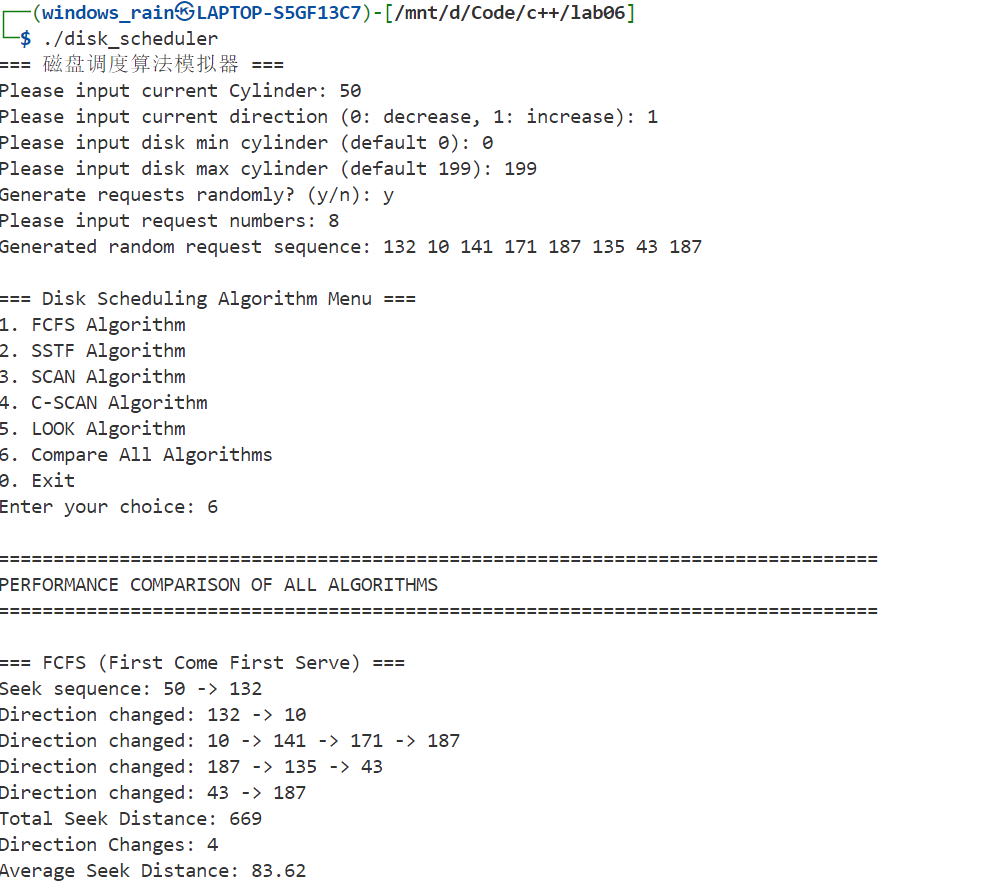
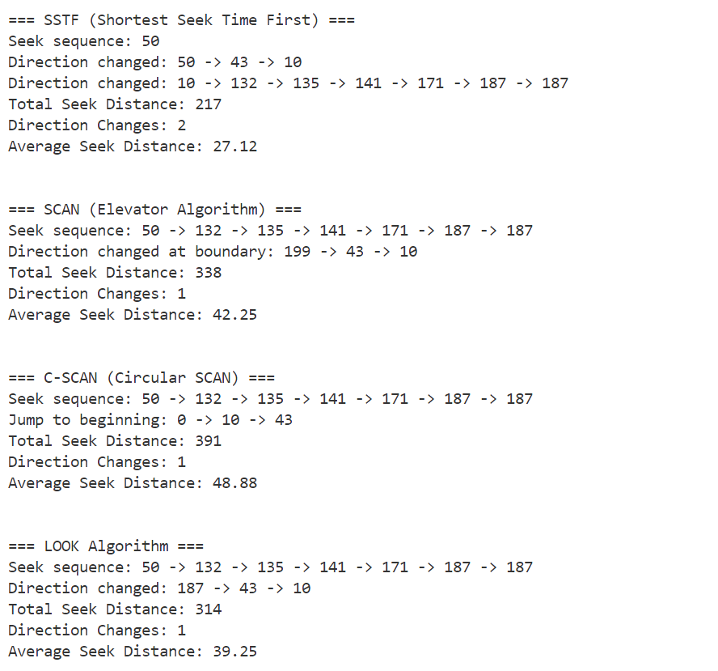
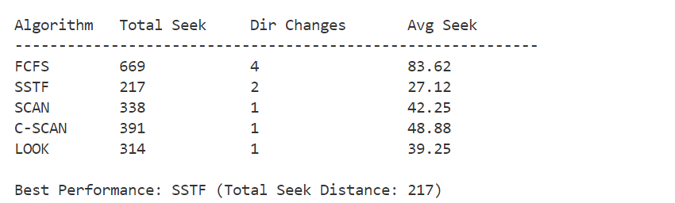

# 磁盘调度算法实验报告

## 实验概述

本实验实现并比较了五种经典的磁盘调度算法：FCFS（先来先服务）、SSTF（最短寻道时间优先）、SCAN（扫描算法）、C-SCAN（循环扫描算法）和LOOK算法。通过模拟磁盘臂的移动过程，分析不同算法在寻道距离、方向改变次数等性能指标上的表现。

## 1. 各个算法的代码实现方案（详细解释）

为了方便进行解释，实验参数设置如下：

当前磁头位置：50号磁道；初始移动方向：向高磁道号方向（1）；磁盘范围：0-199号磁道;随机生成的请求序列：132, 10, 141, 171, 187, 135, 43, 187

### 1.1 FCFS（First Come First Serve）算法

**实现原理：**
FCFS算法严格按照请求到达的先后顺序处理磁盘访问请求，不考虑任何优化策略。

**算法特点：**

该算法的优点在于简单直接，对所有的请求相对而言公平，且无饥饿现象；

但是平均寻道时间长、频繁的方向切换增加开销，且无法利用磁盘访问局部性。

### 1.2 SSTF（Shortest Seek Time First）算法

**实现原理：**
SSTF算法总是选择距离当前磁头位置最近的请求进行处理，采用贪心策略最小化每次移动的寻道时间。

**实现特点：**

该算法使用visited数组标记已处理的请求，避免重复处理

其优点在于每次遍历所有未处理请求，选择距离最小的，使得总寻道距离最小；

但是可能导致某些边缘请求长时间得不到服务（饥饿现象）。

### 1.3 SCAN（电梯算法）算法

**实现原理：**
SCAN算法模拟电梯运行方式，磁头在一个方向上移动，处理路径上的所有请求，直到到达磁盘边界后改变方向。

**代码解释：**

```c++
void DiskArm::SCAN(){
    int totalRequests = RequestNumber + 2;
    int *allCylinders = new int[totalRequests];
    
    // 将请求和边界值合并排序
    for (int i = 0; i < RequestNumber; i++) {
        allCylinders[i] = Cylinder[i];
    }
    allCylinders[RequestNumber] = MinCylinder;
    allCylinders[RequestNumber + 1] = MaxCylinder;
    
    std::sort(allCylinders, allCylinders + totalRequests);
    
    // 根据初始方向选择处理顺序
    if (Direction == 1) {
        // 先处理当前位置到高端的请求
        // 到达边界后改变方向处理低端请求
    } else {
        // 先处理当前位置到低端的请求
        // 到达边界后改变方向处理高端请求
    }
}
```

该代码始终保持单向移动直到边界，且仅在边界处改变方向；在边界点不打印。

**实现特点：**

该算法将所有请求和磁盘边界值统一排序

其优点在于可以保证无饥饿现象，方向切换次数最少（仅1次），还有着较高吞吐量（适合重负载）

但是平均响应时间不如LOOK算法。

### 1.4 C-SCAN（循环扫描）算法

**实现原理：**
C-SCAN算法是SCAN的改进版，磁头到达一端后立即跳转到另一端继续单向扫描，避免了往返扫描可能造成的不公平现象。

**代码解释：**
```cpp
void DiskArm::CSCAN(){
    int *sortedRequests = new int[RequestNumber];
    // 对请求进行排序
    
    if (Direction == 1) {
        // 处理当前位置到高端的请求
        for (int i = currentPos; i < RequestNumber; i++) {
            // 处理请求
        }
        
        // 跳转到磁盘开始位置
        if (currentPos > 0) {
            SeekNumber += abs(Current - MaxCylinder);
            SeekNumber += abs(MaxCylinder - MinCylinder);
            Current = MinCylinder;
            
            // 处理低端剩余请求
            for (int i = 0; i < currentPos; i++) {
                // 处理请求
            }
        }
    }
}
```

**实现特点：**

该算法在于每个请求等待时间更均匀，且消除了位置的不公平性，适合大容量的磁盘。

### 1.5 LOOK算法

**实现原理：**
LOOK算法是SCAN算法的优化版本，磁头不必移动到磁盘边界，而是移动到最远的请求位置后就改变方向。

**核心实现：**
```cpp
void DiskArm::LOOK(){
    int *sortedRequests = new int[RequestNumber];
    // 排序所有请求
    
    if (Direction == 1) {
        // 处理当前位置向高端的所有请求
        for (int i = currentPos; i < RequestNumber; i++) {
            // 到达最高请求后直接改变方向
        }
        
        // 改变方向处理剩余请求
        if (currentPos > 0) {
            SeekChange++;
            for (int i = currentPos - 1; i >= 0; i--) {
                // 处理低端请求
            }
        }
    }
}
```

**实现特点：**

该算法避免了不必要的边界移动：在最后一个请求处改变方向，更加高效。有着最优的平均响应时间。

## 2. 各个算法的效果和性能

### 2.1程序输出结果：







### 2.2性能数据汇总

| 算法 | 总寻道距离 | 方向改变次数 | 平均寻道距离 | 性能排名 |
|------|------------|--------------|--------------|----------|
| FCFS | 669 | 4 | 83.62 | 5 |
| SSTF | 217 | 2 | 27.12 | 1 |
| SCAN | 338 | 1 | 42.25 | 3 |
| C-SCAN | 391 | 1 | 48.88 | 4 |
| LOOK | 314 | 1 | 39.25 | 2 |

### 2.3 详细性能分析

**FCFS：**

该算法中磁头频繁来回移动，4次方向改变，最多，说明磁头移动极不规律：从132跳到10，再从187跳到135，造成大量不必要的寻道。说明仅适合请求量很小或对公平性要求极高的场景。

**SSTF：**

相较于其他算法，该算法总寻道距离最短（217），平均寻道距离最小（27.12），显著减少了磁头移动距离，但在其他情况下可能导致边缘请求饥饿。

**SCAN：**

本算法寻道距离适中，方向改变次数少（1次），效果相对比较公平。

**C-SCAN：**

该算法在进行单向扫描后跳转到磁盘开始位置，而由此造成的额外开销占总距离的53%，使得效率下降。

**LOOK：**

该算法相比SCAN减少了不必要的边界移动，在公平性和效率之间达到良好平衡。

### 2.4 算法特性对比

**寻道效率排序：** SSTF > LOOK > SCAN > C-SCAN > FCFS

**公平性排序：** C-SCAN > SCAN ≈ LOOK > SSTF > FCFS

**稳定性排序：** SCAN ≈ C-SCAN ≈ LOOK > FCFS > SSTF

## 3. 实验结论

通过本次实验，深入理解了不同磁盘调度算法的工作原理和性能特征：

1. **SSTF算法**在寻道效率方面表现最优，但存在公平性问题
2. **LOOK算法**提供了效率和公平性的最佳平衡，是实际系统的理想选择
3. **SCAN系列算法**保证了良好的公平性，适合对响应时间一致性要求高的场景
4. **FCFS算法**虽然效率最低，但在特定场景下仍有其价值


