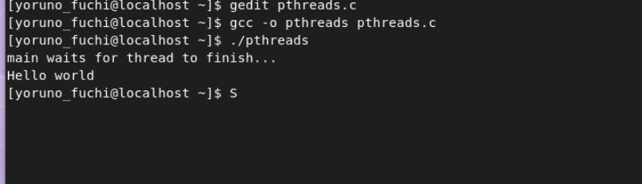

运行和编译多线程代码：

代码如下：

```c
#include <pthread.h>
#include <stdio.h>
#include <stdlib.h>

void* worker(void* arg) {
    printf("Hello World\n");
    return NULL;
}

int main() {
    pthread_t tid;
    if (pthread_create(&tid, NULL, worker, NULL)) {
        printf("Cannot create thread\n");
        exit(1);
    }

    printf("Main waits for thread to finish...\n");

    pthread_join(tid, NULL);
    exit(0);
}
```

在Linux系统中进行编译和执行 得到的结果如下：

